# Windows Server 2022 Enterprise Lab

**Project Type:** Infrastructure & Identity Management  
**Status:** Active / Expanding  
**Focus Areas:** System Administration · Active Directory · Networking · Security Foundations  

---

## Overview
This repository documents the design, deployment, and validation of a **Windows Server 2022 enterprise-style domain environment** built using **Hyper-V virtualization**. This project simulates a small but realistic organizational network to demonstrate hands-on experience with **identity services, name resolution, domain authentication, and client integration**.

Rather than following a scripted tutorial, this lab emphasizes **decision-making, troubleshooting, and operational reasoning**—the same skills required in entry-level system administration and security-focused IT roles.

---

## Technologies & Tools
- Windows Server 2022  
- Active Directory Domain Services (AD DS)  
- DHCP
- DNS  
- Hyper-V  
- Windows 11 Client  
- TCP/IP Networking  
- PowerShell (light usage, expanding)  

---

## Project Objectives
- Deploy and configure a stable Windows Server 2022 domain controller  
- Implement Active Directory and DNS to support centralized authentication  
- Join client systems to the domain and validate authentication flow  
- Identify and resolve real-world configuration issues (DNS, networking, name resolution)  
- Document outcomes with evidence and technical reasoning  

---

## Environment Summary
- **Virtualization Platform:** Hyper-V  
- **Domain Name:** `NetLabz.local`  
- **Topology:** Single-domain, single-domain controller environment (expanding)  
- **Client Systems:** Windows 11, Windows 10

---

<strong>Phase 1 – Lab Setup & Server Installation</strong>

### Objective
Establish a clean Windows Server 2022 baseline in a virtualized environment.

### Implementation Steps
- Created Generation 2 VM in Hyper-V
- Installed Windows Server 2022 (Desktop Experience)
- Verified baseline configuration

### Challenges & Fixes
- Encountered PXE over IPv4 boot error  
  - Root cause: incorrect boot order  
  - Resolution: prioritized ISO boot device

### Evidence

---

<strong>Phase 2 – Server Identity & Networking</strong>

### Objective
Prepare the server for Active Directory by stabilizing identity and networking.

### Implementation Steps
- Renamed server to DC01
- Assigned static IPv4 address
- Configured DNS self-reference
- Verified time synchronization

### Importance
Active Directory relies on stable DNS, IP addressing, and time synchronization.

### Evidence
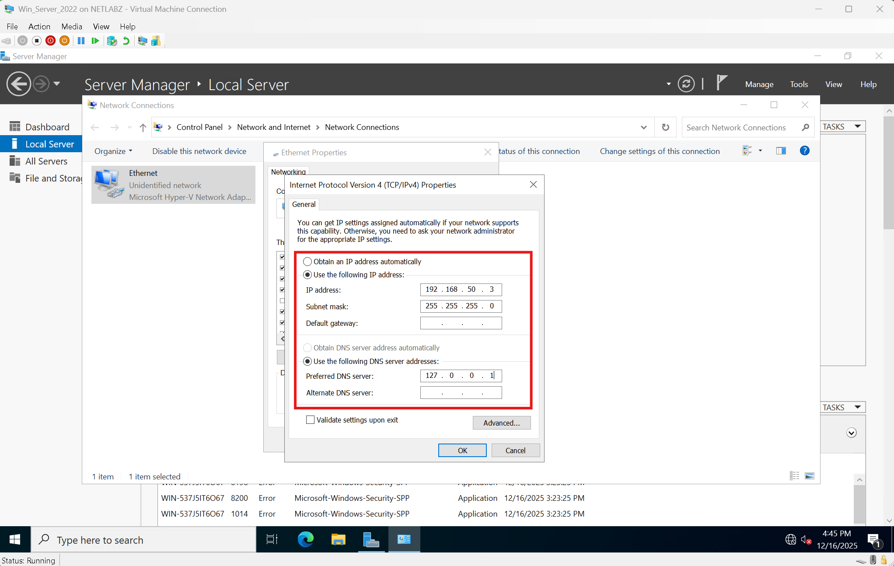
---
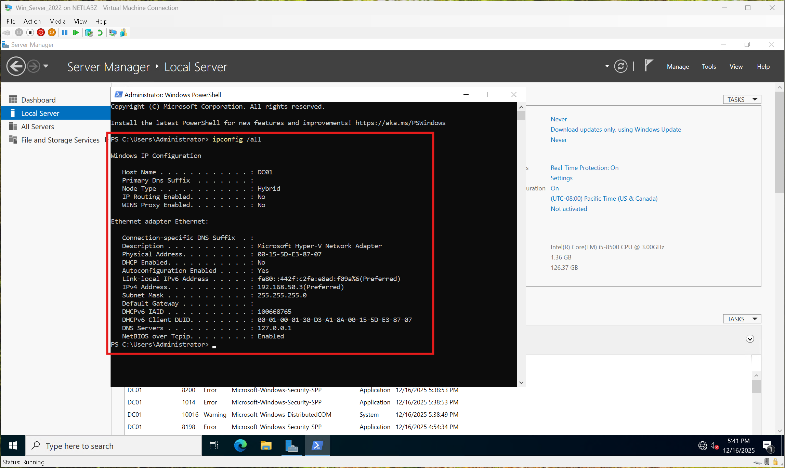
---
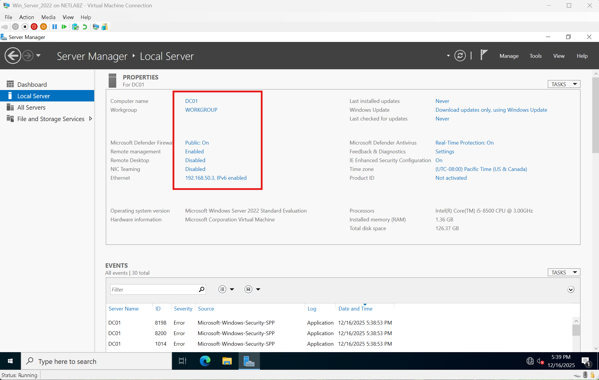
---

---

<strong>Phase 3 – AD DS & DNS Role Installation</strong>

### Objective
Install Active Directory Domain Services and DNS roles in preparation for domain promotion.

### Implementation Steps
- Installed AD DS role
- Installed DNS Server role
- Verified role installation via Server Manager

### Importance
Separating role installation from domain promotion allows administrators to validate system readiness and reduces the risk of configuration errors during forest creation.

### Evidence
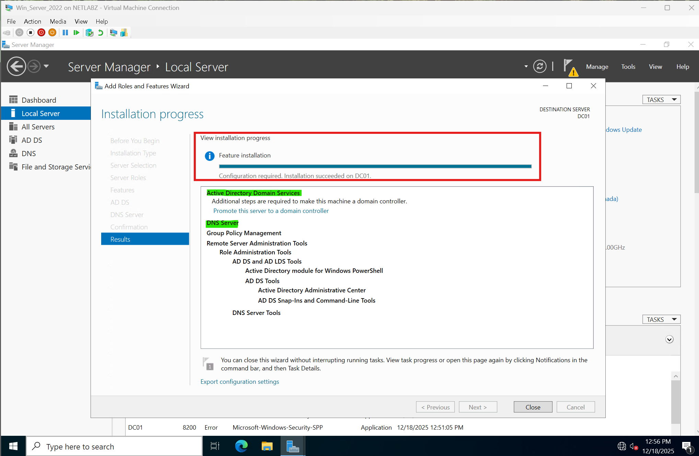
---
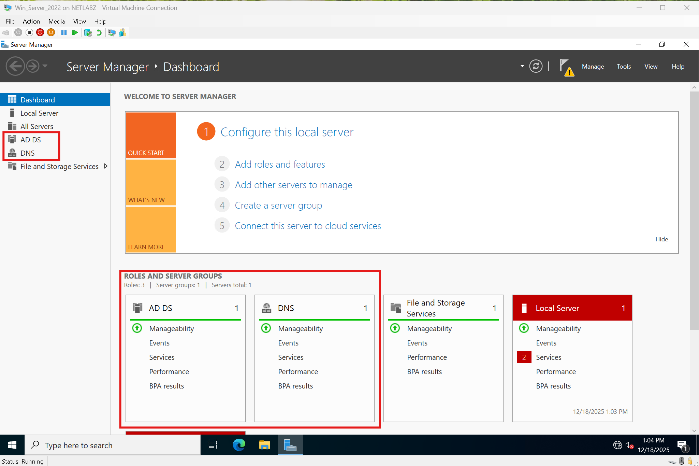

---

<strong>Phase 4 – Domain Promotion & Forest Creation</strong>

### Objective
Create a new Active Directory forest and promote the server to a Domain Controller.

### Implementation Steps
- Created a new forest (`NetLabz.local`)
- Promoted DC01 to a Domain Controller
- Installed and verified AD-integrated DNS
- Verified ADUC and DNS post-promotion

### Importance
Forest creation defines the security boundary of an Active Directory environment. Proper domain naming, DNS integration, and functional level selection are critical for long-term stability.

### Evidence
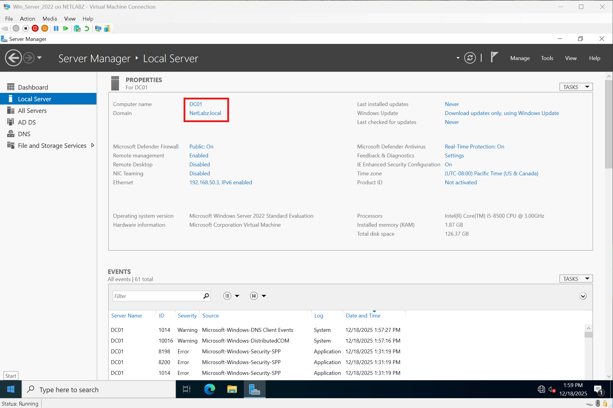
---
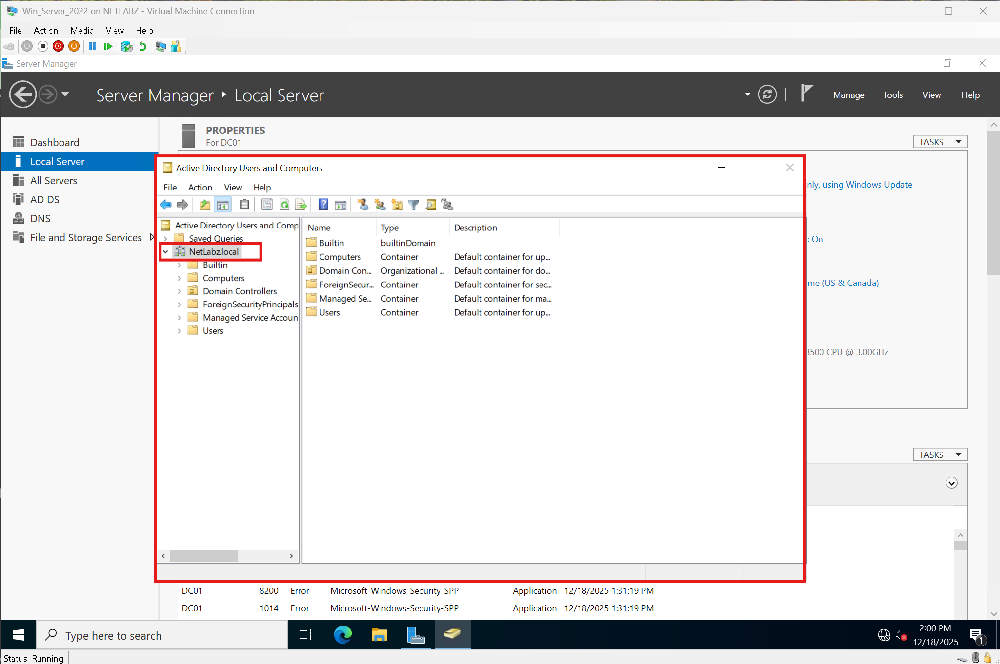
---
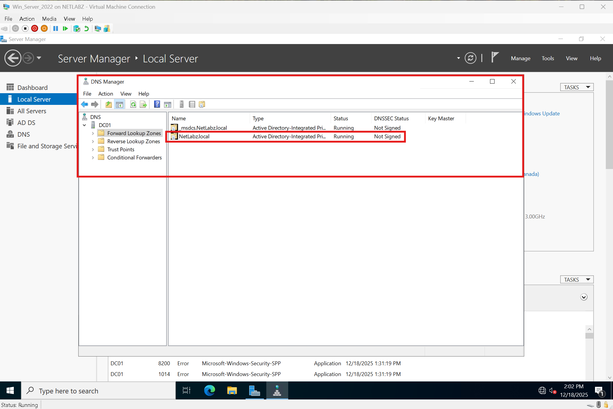

---

<strong>Phase 5 – Active Directory Users, Groups, and Client Integration</strong>

### Objective
Simulate real-world Active Directory administration by structuring Organizational Units, managing users and groups, and successfully joining a Windows 11 client to the domain.

---

### Implementation Steps
- Created Organizational Units for departmental organization:
  - Research OU
  - Human Resources OU
  - Production OU
- Pre-staged a client computer object in Active Directory Users and Computers
- Created a security group for departmental access control
- Implemented a user template account and created new users by copying the template
- Assigned users to the appropriate security groups
- Deployed a Windows 11 Enterprise Evaluation client VM
- Attempted and completed domain join of the client system

---

### Issue Encountered
During the domain join process, the client system was unable to contact the Domain Controller, resulting in a domain connectivity error.

Initial review suggested the domain name and credentials were correct, and the computer object already existed in Active Directory. However, the join process consistently failed.

---
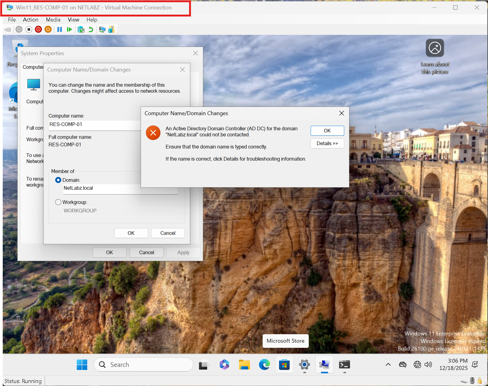

---

### Analysis & Troubleshooting
Using `ipconfig /all`, I identified multiple network configuration issues on the client system:

- The client IP address was not within the same subnet as the Domain Controller
- The subnet mask did not align with the domain network
- The DNS server configuration did not initially point to the Domain Controller.
  - I forgot to capture the evidence of the DNS server mismatch before changing it to DC01
---
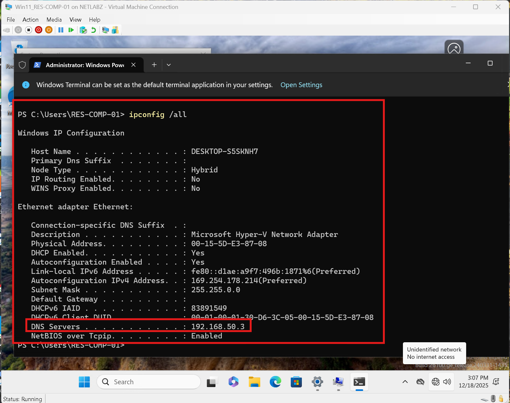

---

These misconfigurations prevented the client from locating the Domain Controller and resolving the domain properly.

---

### Resolution
- Manually configured the client with a static IPv4 address within the same subnet as the Domain Controller
- Corrected the subnet mask to match the domain network
- Set the DNS server to the Domain Controller’s IP address
- Re-attempted the domain join using domain administrator credentials

After correcting the network configuration, the client successfully joined the domain and automatically associated with the pre-staged computer object in Active Directory.

---
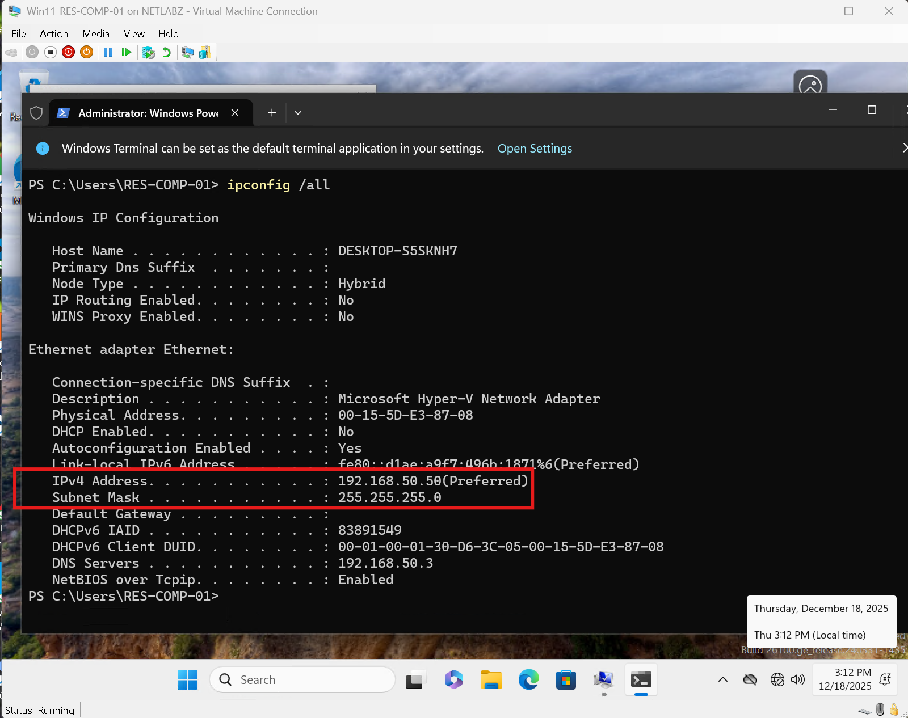

---

### Validation
- Client system displays full domain membership (`RES-COMP-01.NetLabz.local`)
- Domain credentials authenticate successfully
- Computer object appears correctly in the designated OU
- User group memberships reflect intended access design

Screenshots included in this phase document the troubleshooting process, configuration changes, and successful domain join.

---
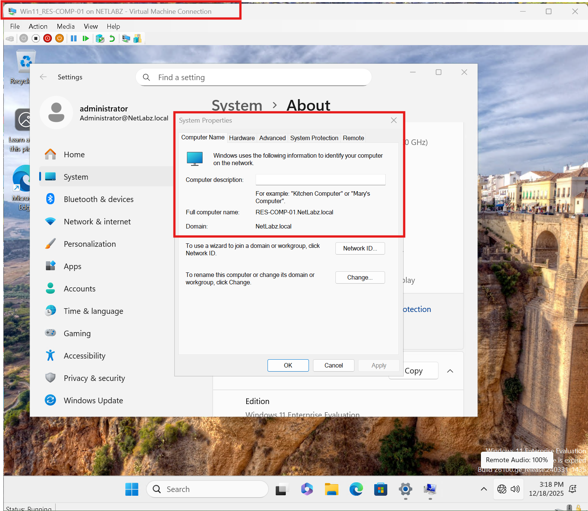

---

### Key Takeaway
This phase reinforced the dependency Active Directory has on correct DNS and network configuration. Even with properly created OUs, users, and computer objects, domain operations will fail if fundamental networking requirements are not met.

---

<strong>Phase 6 – File Server Configuration & Permission Enforcement</strong>

### Objective
Configure a centralized file server using Active Directory security groups and NTFS permissions, then validate access control from a domain-joined Windows 11 client.

### Implementation Steps
- Created a centralized directory structure:
  - `C:\Shared_Folder`
- Created department-specific folders:
  - `HR_Shared`
  - `Production_Shared`
  - `Research_Shared`
- Enabled a network path via **Advanced Sharing** for each department folder
- Assigned **share permissions** using domain security groups (e.g  `HR_Employees`)
- Configured **NTFS permissions** to allow least-priviledge access ONLY
- Disabled NTFS inheritance on department folders to enforce explicit permissions
- Re-applied required permissions after inheritance removal:
  - `Administrators` – Full Control
  - `SYSTEM` – Full Control
  - Department security group – Modify
- Verified access using a User from HR department group and verified Denial from Production user group.

---

### Troubleshooting & Observations
- Disabling NTFS inheritance removed all inherited permissions, temporarily locking access to the folder
- Ownership had to be confirmed before explicit permissions could be added
- Permission controls were initially greyed out until ownership and inheritance were corrected
- Share permissions alone were not sufficient; NTFS permissions also needed to explicitly allow access
- Access failures highlighted that the **most restrictive permission always applies**
- During testing, the user account also required membership in **Remote Desktop Users** for successful validation in this scenario.
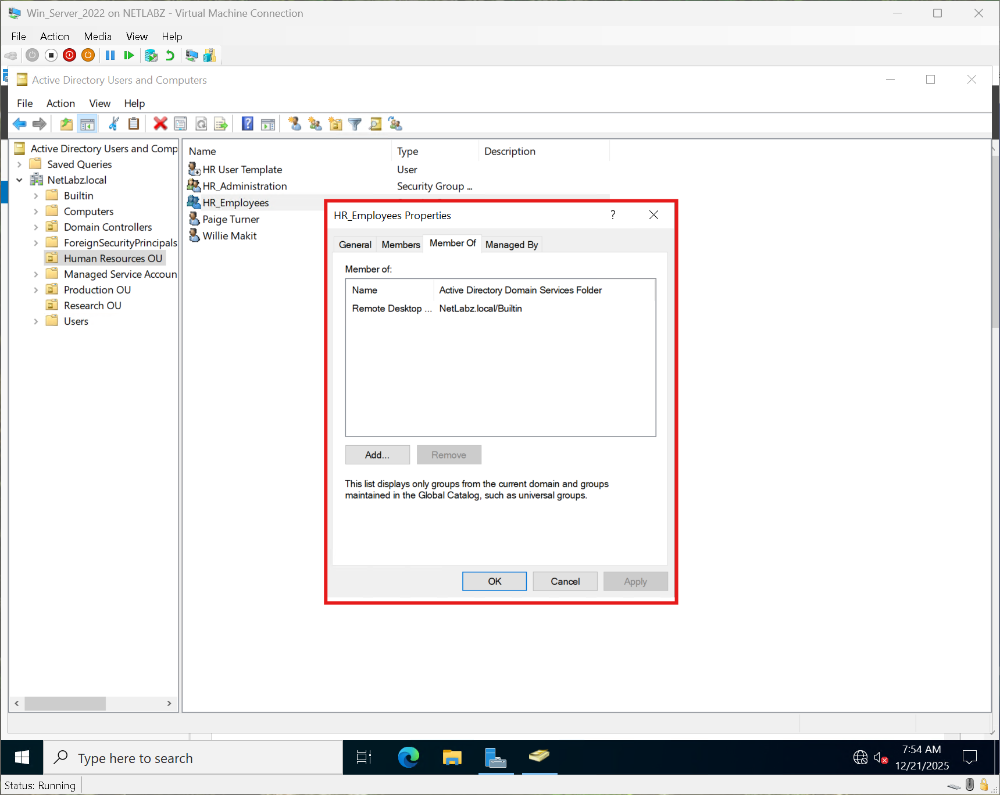

---

### Validation
- Logged in as a domain user from `Win11_RES-COMP-01`
- Successfully accessed `\\DC01\HR_Shared`
- Created a test folder to confirm write permissions
- Verified access denial for users not in the assigned security group

---

### Importance
File servers rely on precise permission layering. This phase demonstrates how Active Directory group design, share permissions, and NTFS permissions must align to securely control access. Misconfigurations at any layer can result in unexpected access failures or security exposure.

---

### Evidence
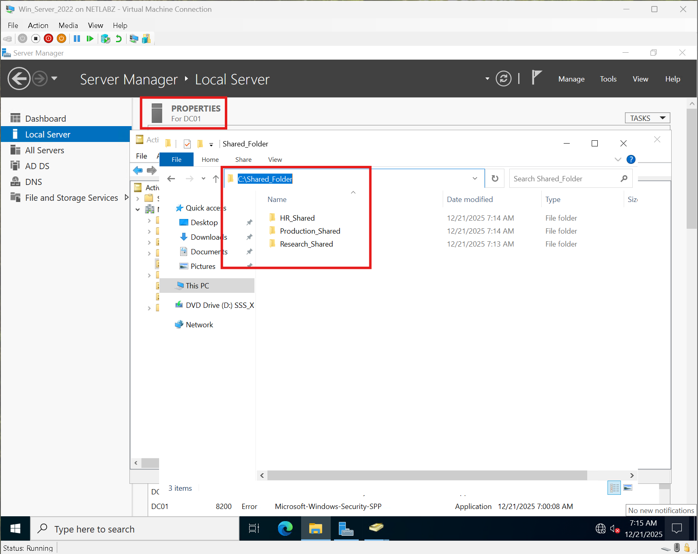
---
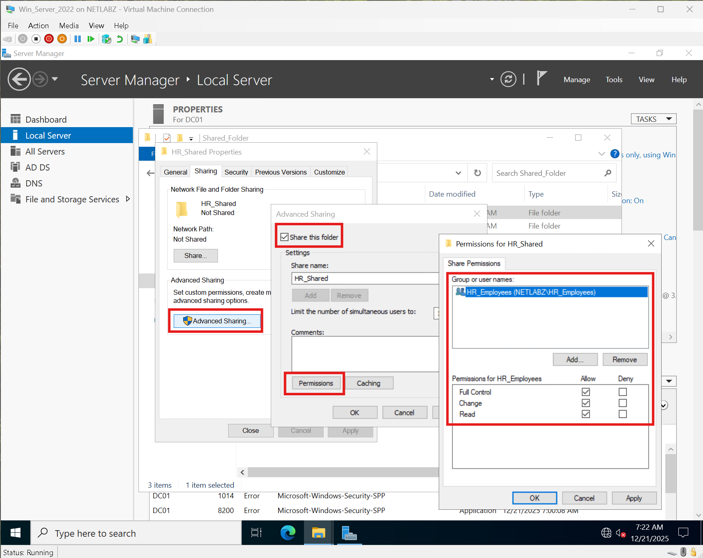
---
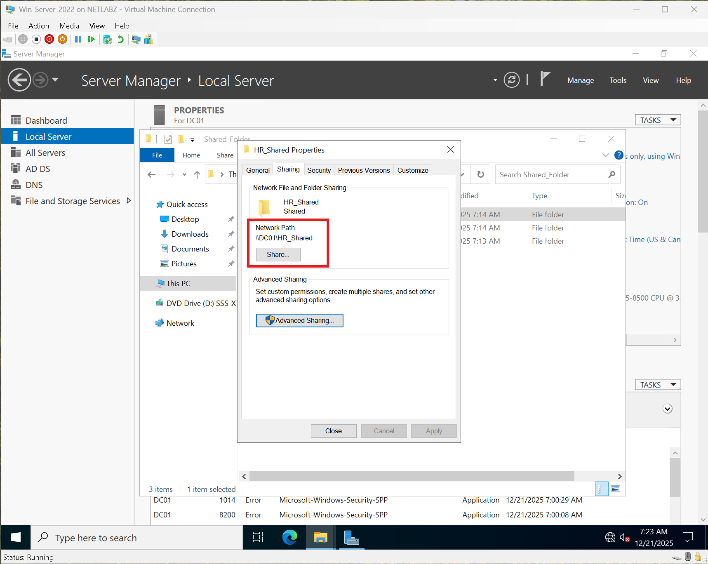
---
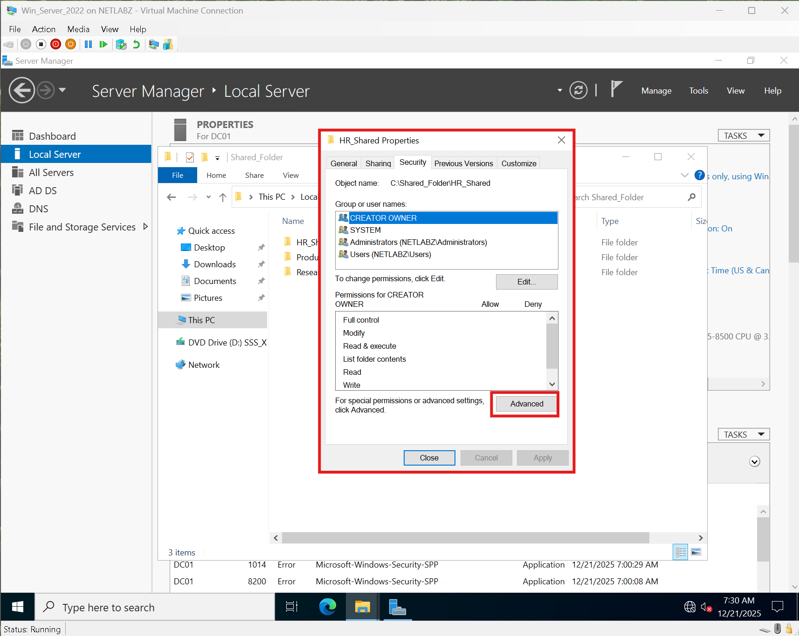
---
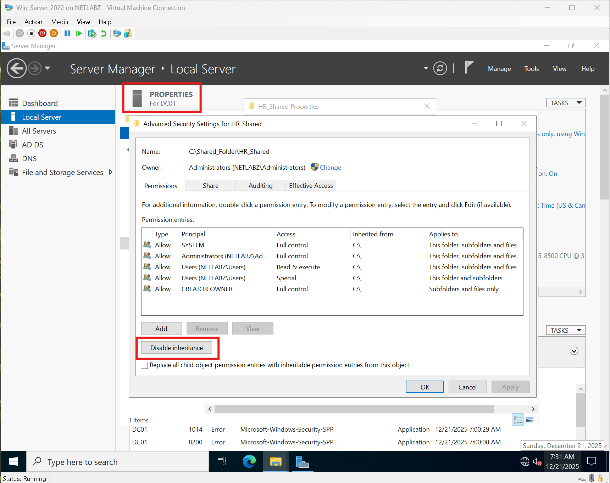
---
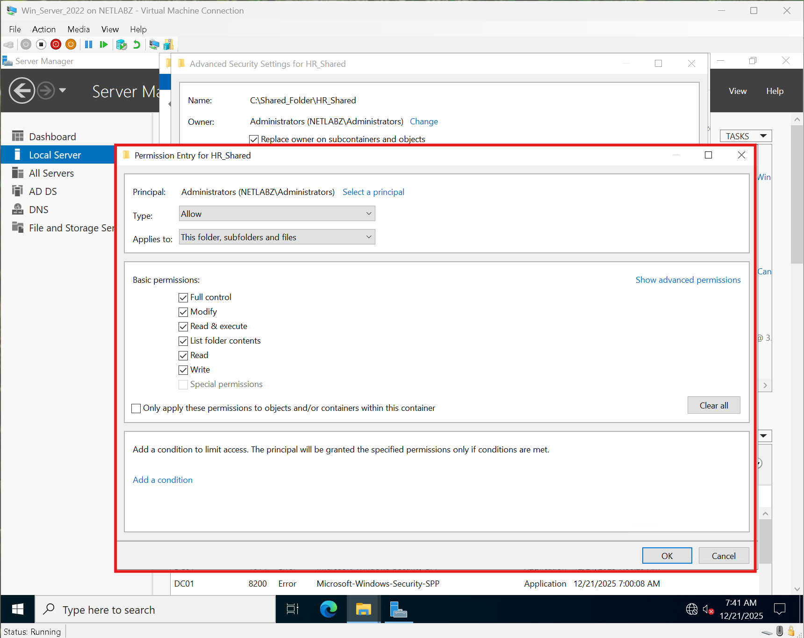
---
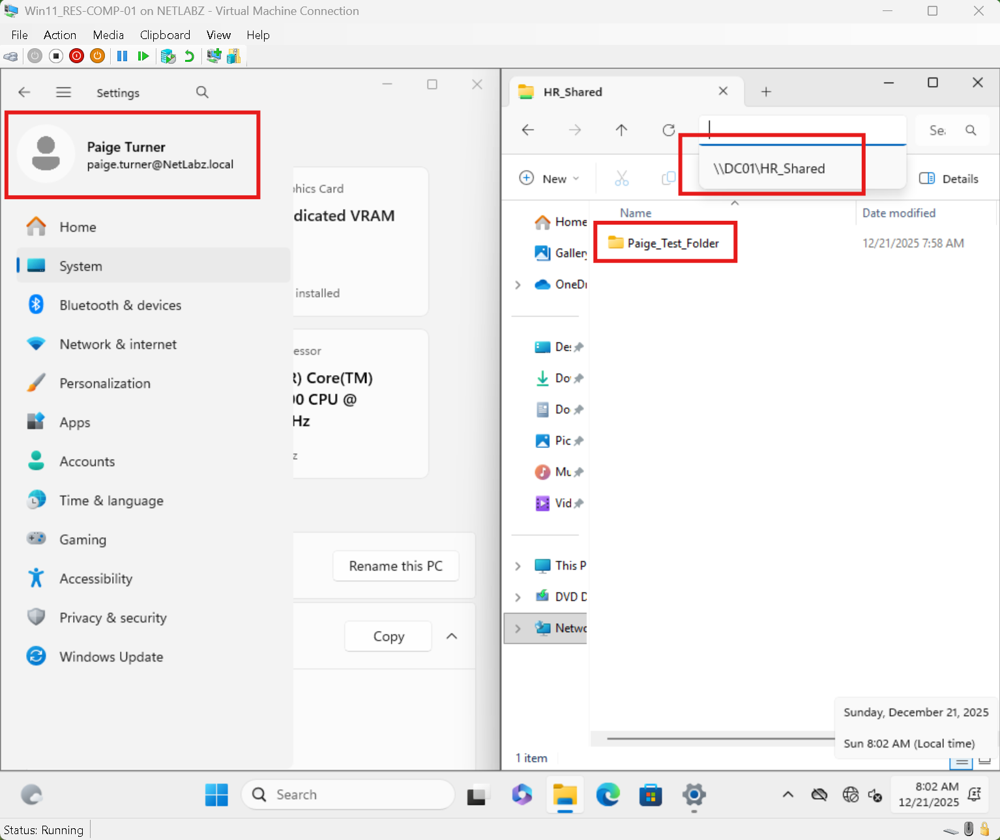
---
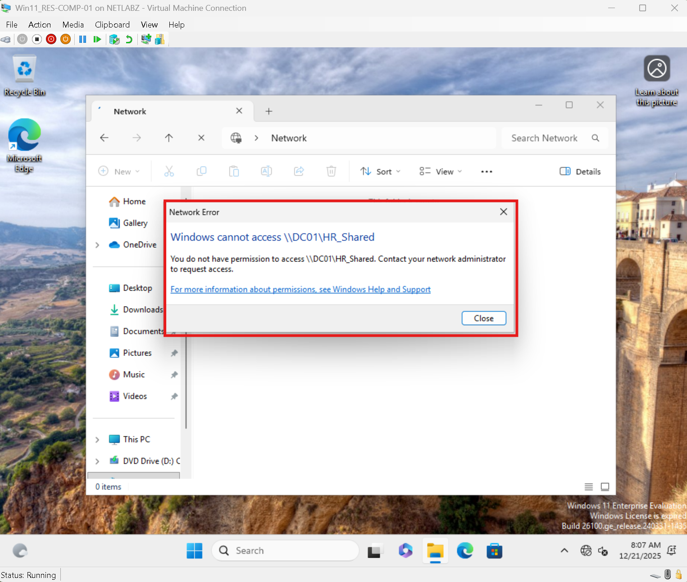

---

## 🚧 Project Status – Work in Progress

This environment is actively being expanded to reflect additional real-world Active Directory, systems administration, and security scenarios. The foundation is complete, and future phases will build directly on the existing domain, users, groups, and client systems already in place.

Rather than restarting or restructuring the lab, upcoming work will focus on layering functionality, tightening controls, and introducing realistic operational challenges.

---

## Planned Next Phases

### Phase 7 – Group Policy Implementation
- Create and link GPOs at the OU level
- Enforce basic security and workstation policies
- Test policy application and results on client machines
- Troubleshoot policy precedence and inheritance

---

### Phase 8 – Authentication, Access, and Hardening
- Review authentication flow (DNS, Kerberos, domain logons)
- Apply baseline hardening where appropriate
- Introduce intentional misconfigurations to test troubleshooting skills
- Document security considerations and lessons learned

---

## 📌 Ongoing Goals
- Continue documenting both successes and failures
- Prioritize realism over perfection
- Maintain clear evidence of configuration, validation, and troubleshooting
- Evolve the lab without unnecessary redesign or scope resets
